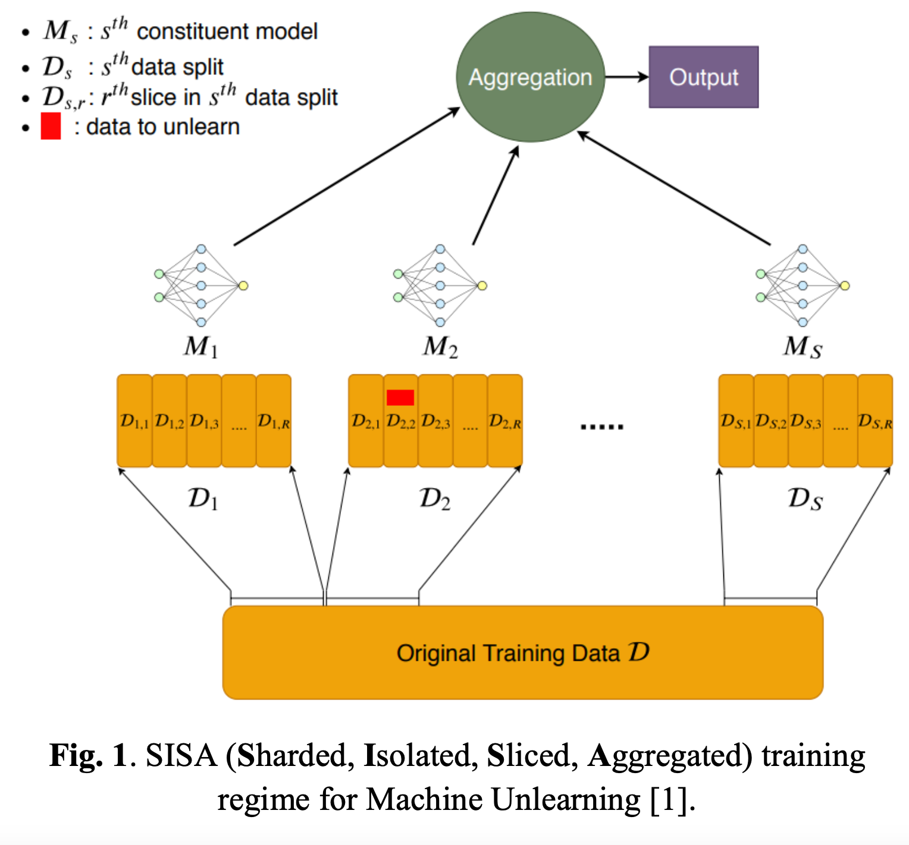

# Machine Unlearning with SISA - EC523 with Prof. Kayhan Batmanghelich

[[link to our report](https://drive.google.com/file/d/13QB1aaQCEodEsl4O-F0M-2J-fDTbIPag/view?usp=sharing)]

### Harshil Gandhi, GM Harshvardhan, Shaunak Joshi

This is our improvements to the original implementation of [SISA Machine Unlearning](https://arxiv.org/abs/1912.03817) paper.

We have made improvements using 2 approaches:
1. Greedy Distribution-Aware Sharding: In the branch named "Approach-1"
2. Clustering similar data points: In the branch named "Approach-2"

You can start running experiments by having a look at the readme in the purchase example folder at ``example-scripts/purchase-sharding``.

``sisa.py`` is the script that trains a given shard. It should be run as many times as the number of shards.

